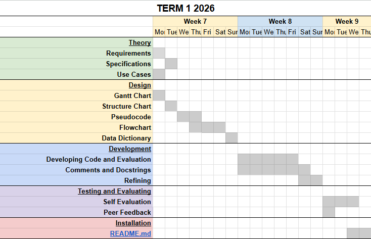

# Current F1 Drivers
10PSE Task 1

## Requirements
### Functional Requirements
**User Requirements**  
The user needs to be able to:  
1. Search for a F1 driver by entering their name
2. View drivers belonging to a specific team
3. View drivers of different nationalities

**Inputs and Outputs**  
The system will accept inputs including:
1. The name of the drivers
2. The name of the teams
3. The nationality of the drivers

and the corresponding outputs would be:  
1. The information on the specific driver
2. The drivers in that team
3. The drivers of that nationality

**Core Features**  
The program needs to clearly produce the requested information from the API URL that the user has asked for. It should search and filter data based on driver name, team name and nationality and handle incorrect or missing user inputs. 

**User Interaction**  
The program will be used through a command-line interface and I will create a README.md file. The README.md file will provide a:
1. Description of my program
2. Setup Instructions (txt file)
3. How to run the program
4. Examples of valid inputs
5. Dependancies

**Error Handling**
My system must handle unidentified wrong inputs or errors in the API URL. This includes unexpected inputs of driver or team names, errors or missing fields in the API and APU connection failures. 

### Non-Functional Requirements
**Performance**  
My program should respond quickly enough so that the users dont feel the system lagging. The responses should be efficient and be kept under a second at best to maintain user engagement. 

**Useability/Accessibility**  
The program should have clear prompts asking users exactly what they need to type, consistent formatting with clearn readable outputs with spacing, indentation and lables and also helpful error messages to show when the wrong inputs were put in. 
(users whouldnt need to type exact names, shortcuts)

**Reliability**  
Potential issues may include API downtime, missing data, incorrect user inputs and duplicated data. The program shuld allow the users to try again, show a error message, and filter out unneeded extra information. 

## Use Cases
### Use Case 1 - Search for a F1 driver by entering their name
**Actor**  
User

**Preconditions**  
- The F1 API is reachable
- The requirements.txt has been installed

**Main Flow**  
1. User enters a driver's name (e.g. "Charles Leclerc")
2. System retrieves all driver data from the API
3. System searches for a matching driver
4. System displays the driver's details

**Alternative Flows**
- Driver not found : System displays 'Driver not found. Please try again'
- API downtime : System displays "Unable to retrieve driver data. Please try again after a little while."

### Use Case 2 - View drivers belonging to a specific team
**Actor**  
User

**Preconditions**  
- The F1 API is reachable
- The requirements.txt has been installed

**Main Flow**  
1. User enters a team name (e.g. "Ferrari")
2. System retrieves all drivers from the API
3. System filters drivers whose team matches the input
4. System displays the list of drivers in that team

**Alternative Flows**
- Team not found : System displays 'Team not found. Please try again'
- API downtime : System displays "Unable to retrieve team data. Please try again after a little while."

### Use Case 3 - View drivers of different nationalities
**Actor**  
User

**Preconditions**  
- The F1 API is reachable
- The requirements.txt has been installed

**Main Flow**  
1. User enters a country (e.g. "Australia")
2. System retrieves all drivers from the API
3. System filters drivers by country name
4. System displays all matching drivers

**Alternative Flows**
- Country not found : System displays 'No drivers found with this nationality'
- API downtime : System displays "Unable to retrieve data. Please try again after a little while."

## Determining Specifications
### Functional Specifications
### Non-Functional Specifications

## Structure Chart
## IPO - input, process, output
## Gantt Chart  - Development  
Start

End

## Data Dictionary

## Design
## Development
## Integration
## Testing and Debugging
### Student feeback - Arisa Komatsu
### Student feedback - Isabella Usacheva
## Maintenance
