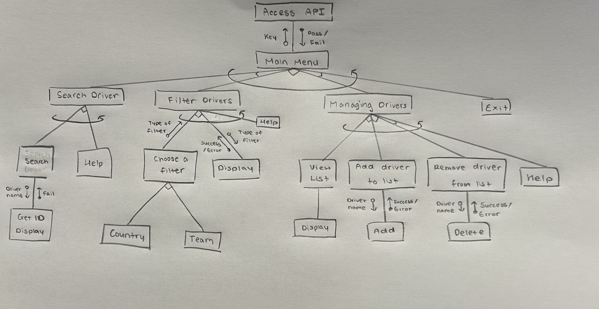
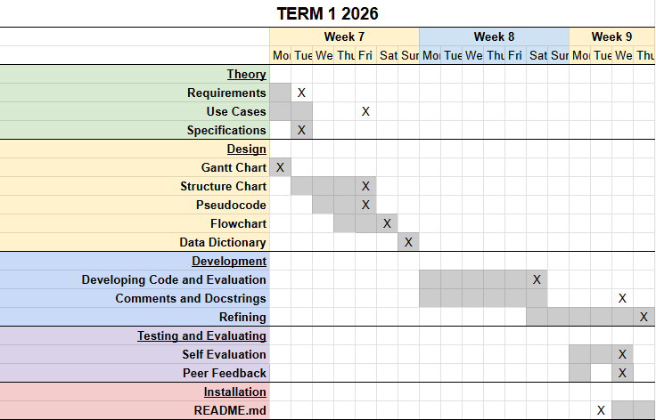

# Current F1 Drivers
10PSE Task 1

## Requirements
### Functional Requirements
**Data Retrieval**  
The user must be able to view information about specific F1 drivers, team or country and their own lists created through the program.

**User Interface**  
There has to be a way for users to search or filter information to create outputs such as a clear display clear results and a way to manage their personal lists. 

**Data Display**  
The user needs to obtain information such as thier name, age, nationality and their current team. There should also be seperate lists based on teams or nationalities of the drivers and the user's personal driver list.

### Non-Functional Requirements
**Performance**  
The system needs to respond quickly and handle user inputs without any delays. Searching for a driver, filtering by team or nationality or updating the user's list should feel immediate so that the experience remains smooth. It should handle multiple searches without slowing down and manage the full API without errors or lags.

**Reliability**  
The systems needs to be dependable so users trust the information provided. Driver data, team lists and nationality filters must always produce accurate and consistent results and make sure to update correctly every time when the list is changed. It should also make sure the system does not crash, lose data or produce inconsistent outputs depending on the order of actions.

**Usability and Accessibility**  
The system needs to be easy and clear to navigate so users can find what they need without confusion. Clear labels and simple menus should help users understand how to work the program and the interface should avoid clutter and present the results in a clean, readable format. Instructions on what to input should be brief and direct. The README.md file will present step by step instructions for users on how to use and access the system.

## Determining Specifications
### Functional Specifications
**User Requirements**  
The user needs to be able to:  
1. Search for a F1 driver by entering their name
2. Filter drivers based on team or nationality
4. View their list

**Inputs and Outputs**  
The system will accept inputs including:
1. The name of the drivers
2. The filter - team or nationality
2. The name of the team or country
4. The name of the driver they either want to add or remove from their list

and the outputs would be:  
1. The information on the specific driver
2. The drivers in that team
3. The drivers of that nationality
4. Their list

**Core Features**  
The program needs to clearly produce the requested information from the API URL that the user has asked for. It should search and filter data based on driver name, team name and nationality and handle incorrect or missing user inputs. 

**User Interaction**  
The program will be used through a command-line interface and I will create a README.md file. The README.md file will provide a:
1. Description of my program
2. Setup Instructions (txt file)
3. How to run the program
4. Examples of valid inputs
5. Dependancies

**Error Handling**
My system must handle unidentified wrong inputs or errors in the API URL. This includes unexpected inputs of driver or team names, errors or missing fields in the API and APU connection failures. 

### Non-Functional Specifications
**Performance**    
My program should respond quickly enough so that the users dont feel the system lagging. The responses should be efficient and be kept under a second at best to maintain user engagement. 

**Useability/Accessibility**    
The program should have clear prompts asking users exactly what they need to type, consistent formatting with clearn readable outputs with spacing, indentation and lables and also helpful error messages to show when the wrong inputs were put in. 
(users whouldnt need to type exact names, shortcuts)

**Reliability**  
Potential issues may include API downtime, missing data, incorrect user inputs and duplicated data. The program shuld allow the users to try again, show a error message, and filter out unneeded extra information. 

## Use Cases
### Use Case 1 - Search for a F1 driver by entering their name
**Actor**  
User

**Preconditions**  
- The F1 API is reachable
- The requirements.txt has been installed

**Main Flow**  
1. User chooses option no.1
2. User enters a driver's name (e.g. "Charles Leclerc")
3. System retrieves all driver data from the API
4. System searches for a matching driver
5. System displays the driver's details

**Alternative Flows**
- Wrong input for choosing an option : System displays 'Invalid option. Please try again.'
- Driver not found : System displays 'Driver not found. Please try again.'
- API downtime : System displays "Unable to retrieve driver data. Please try again after a little while."

### Use Case 2 - Filter drivers based on team or nationality
**Actor**  
User

**Preconditions**  
- The F1 API is reachable
- The requirements.txt has been installed

**Main Flow**  
1. User chooses option no.2
2.  User choose a filter
        a. Team 
                - Users can view all drivers of each team
                - Users can choose and view drivers of a specific team
        b. Country
                - Users can view all drivers of each nationality
                - Users can choose and view drivers of a specific nationality
        

**Alternative Flows**
- Wrong input for choosing an option : System displays 'Invalid option. Please try again.'
- Filter not found : System displays 'Invalid filter type. Please try again: '
- Team not found : System displays 'Team not found. Please try again.'
- Country not found : System displays 'Country not found. Please try again.'
- API downtime : System displays "Unable to retrieve team/country data. Please try again later."

### Use Case 3 - Their list
**Actor**  
User

**Preconditions**  
- The F1 API is reachable
- The requirements.txt has been installed

**Main Flow**  
1. User chooses option no.3
2. User chooses out of viewing, adding or removing from their list  
        * Viewing - Program outputs the list  
        * Adding - User inputs the name of the driver they want to add to their list  
        * Removing - User inputs the name of the driver they want to remove from their list

**Alternative Flows**
- Wrong input for choosing an option : System displays 'Invalid option. Please try again.'
- Nothing to view : System displays 'No drivers found in your list. Please add a driver before trying again.'
- Driver not found : System displays 'Driver not found. Please try again.'
- Driver not found in list : System displays 'Driver not found in list. Please try again.'
- API downtime : System displays "Unable to retrieve data. Please try again after a little while."

## Design
### Pseudocode
**Main Menu**  
```
BEGIN main_menu  
        driver_list =[]  
        SET exit = False

        WHILE exit = False
                DISPLAY "1. Search for driver"
                DISPLAY "2. Filter drivers"
                DISPLAY "3. Manage your list"
                DISPLAY "4. Exit"

                GET choice

                If choice = 1
                        CALL search_driver
                Elif choice = 2
                        Call filter_driver
                Elif choice ' 3
                        CALL user_list
                Elif choice = 4
                        DISPLAY "Exiting F1 Menu... Thank You!"
                        SET exit = True
                Else
                        DISPLAY "Invalid option. Please try again."
                ENDIF
        ENDWHILE

END main_menu
```

**Searching for drivers**
```
BEGIN search_driver
        DISPLAY "Enter the driver's name: "
        GET name

        IF name = FOUND
                DISPLAY driver name
                DISPLAY driver birthday
                DISPLAY driver number
                DISPLAY driver nationality
                DISPLAY driver team
        ELIF name = NOT FOUND
                DISPLAY "Driver not found. Please try again."
        ELSE 
                DISPLAY "Unable to retrieve data. Please try again."
        ENDIF

END search_driver
```

**Filtering drivers**
```
BEGIN filter_drivers
        DISPLAY "Do you want to filter by team or country?: "
        Get filter type

        IF 

        If filter type = team
                DISPLAY "Enter team name: "
                GET team name

                IF

        ELIF filter type = country
                DISPLAY "Enter country name: "
                GET country name

        ELSE
                DISPLAY "Invalid filter type. Please try again: "
```
**Managing the user's list**
```
BEGIN user_list
        DISPLAY "1. View your list"
        DISPLAY "2. Add a driver to your list"
        DISPLAY 3. "Remove a driver from your list"
        GET choice

        If choice = 1
                IF user_list = empty
                        DISPLAY "No drivers found in your list. Please add a driver before trying again."
                ELSE
                        DISPLAY user_list
                ENDIF

        ELIF choice = 2
                DISPLAY "Enter the name of the driver to add: "
                GET name

                If name = not found
                        DISPLAY "Driver not found. Please try again."
                ELIF driver in user_list
                        DISPLAY "The driver is already in your list."
                ELSE
                        ADD driver to user_list
                        DISPLAY "The driver has been added to your list"
                ENDIF

        ELIF choice = 3
                DISPLAY "Enter the name of the driver to remove"
                GET name

                IF name = not found
                        DISPLAY "Driver not found. Please try again."
                ELSE
                        REMOVE driver from user_list
                        DISPLAY "The driver has been removed from your list."
                ENDIF
        
        ELSE 
                DISPLAY "Invalid option. Please try again"
        ENDIF

END user_list
```

### Flowchart

### Structure Chart


### IPO - input, process, output
### Gantt Chart  - Development  


### Data Dictionary
| Field | Datatype | Format for display | Description | Example | Validation |
|----------|--------------|------------------------|------------------|-------------|----------------|
| Driver Name | string | XX...XX  | The full name of the F1 driver the user searches for or adds/removes from their list | Charles Leclerc | Must contain letters and spaces only; cannot be empty |
| Team | string | XX...XX | The team used when filtering drivers | Ferrari | Must match a valid team name from the API |
| Country | string | XX...XX | The country used when filtering drivers | Monaco | Must contain letters only; must match API data |
| Filter Type | string | XX...XX | Determines how the system filters drivers | team | Must be exactly “team” or "country" |
| Filter Value | string | XX...XX | The team or nationality entered by the user | Ferrari | Must match API data |
| List Action | string | XX...XX | The action the user chooses for their list | add | Must be one of the three valid options |
| User List | list | XX...XX | The list of drivers saved by the user | Charles Leclerc | No duplicates and each entry must be a valid driver |
| Error Message | string | XX...XX | Message displayed when an input or API issue occurs | Driver not found. | Must clearly describe the issue |

## Development


## Integration


## Testing and Debugging
### Student feeback - Arisa Komatsu
Yuna's F1 API application is overall exemplary, aligning with all her functional requirements and including all features that were planned in her design stage. In terms of the outlined non-functional requirements, her program is very efficient and has fast response times within one second, and any user input errors are gracefully identified and responded to with clear error messages. Her code also allows for users to retry after any mistakes, which enhances the user experience. Additionally, her help function is specific to each feature and is very useful for navigating the program and concisely states what inputs are expected from the user. 

The README file provided for her application is comprehensive and easy to understand. One improvement could be that it could be structured a little better as in 'How to run' she states how to download the program's dependencies before stating which ones are used? idk

### Student feedback - Isabella Usacheva
Yuna's code reflects both the functional and non-functional requirements well, and the response time is immediate. Requirements.txt and the README.md file are both incredibly accurate, with the README.md file being structured nicely, and clearly explains what is required to run the program. The code runs really well, with any desired options there; I didn't want to find anything that wasn't already supplied.

## Maintenance
### How would you handle issues cause by changes to the API over time?
### How would you ensure the program remains compatible with new versions of Python and libraries
### Describe the steps you would take to fix a bug found in the program after deployment
### Outline how you would maintain clear documentation and ensure the program remains easy to update in the future

## Final Evaluation
### Evaluate the current functionality of the program in terms of how well it addresses the functional and non-functional requirements
My program successfully addresses all the functional and non-functional requirements I established at the start. It retrieves accurate information about the F1 drivers, teams and nationalities and allows users to create, update and manage their own lists without errors. The system handles API calls correctly, displays clear error messages when something goes wrong and responds quickly to user inputs. All features such as filtering, searching and list management produce the expected outputs and operate consistently. Overall, my program behaves exactly as intended and matches the goals that I had set at the start of the project.

### Discuss areas for improvement or new features that could be added.
Although the program is fully functional, there are several areas of improvement that could enhance user experience and extend the functionality of my program. The help functions could have been more deatiled and advanced and integrated into the program so that you could open it whenever you want. It would also have been better is I were to improve the visual representation of the output such as adding borders, spacing or other elements like emojis. This would make the interface more engaging and easier to read. Incorporating visualisations of different elements like team logos and driver images could also make the program feel more dynamic and less text-heavy, boring and bland to read. 

Some new features that could have been added include expanding the filtering system to give more flexibility. Allowing searches by driver numbers or nicknames would deepen the user's ability of explore the dataset even more. Sorting options such as alphabetical order or age could also improve navigation throughout the program. 


### Evaluate how the project was managed throughout its development and maintenance, including your time management and how challenges were addressed during the software development lifecycle.
My project management has clear areas for improvement. My requirements were clear from the beginning which helped guide the development of the program but some of my milestones weren't realistic and had to be adjusted later. This led to parts of the design phase  to be rushed, which required me to revise it all again to make sure that everything fit together. After changing and adding different components to my structure chart, I had to redo the other parts of my design making me off track from my gantt chart even more. The design section was the clear bottleneck during my task as my code came together faster than I expected it to. 

Code reviews were carried out continuously, although most of my code was completed in two major commits. As I added more code after finishing the base outline, I has to test continuously as even if it had the smallest errors, it caused the entire program to fail silently without any error notifications. The most significant challenge in my code was how to correctly fetch the API which required me to rewrite the search_driver function to avoid reaching the API endpoint before successfully retreiving the information I needed. Additional difficulties included adding the pandas and datetime modules to create my Final Interaction Log as they initially kept interfering with the other functions, causing them to glitch and output nothing. The Final Interaction Log also refused to produce anything at first as something was going wrong when creating the def function. 

Reflecting on my development markdown file, there are specific areas for improvement. Completing the structure chart early in the design phase would help me avoid major redesigning later. Enhancing the visual appeal of the outputs would create a more engaging user experience and incorporating visualisations could make the program feel more dynamic. Finally, setting more realisting milestones could help me maintain a steady workflow and reduce the need to rush through any adjustments. 