# Current F1 Drivers
10PSE Task 1

## Requirements
### Functional Requirements
**Data Retrieval**  
User must be able to easily access information about F1 drivers, teams, nationalities, and their own saved driver lists. They should get quick, accurate results when searching for a specific driver or filtering by team or nationality. The system must also retreive driver data from the API reliably and structure it so it can be searched, filtered, and displayed.

**User Interface**  
Users need a simple, clear interface that allows them to search, filter, and manage their lists without confusion. Menu options should be easy to understand, and results should be displayed in a clean, readable format. The interface must validate user input, handle mistakes gracefully, and prevent crashes caused by invalid entries.

**Data Display**  
The user needs to obtain information such as thier name, age, nationality and their current team. There should also be seperate lists based on teams or nationalities of the drivers and the user's personal driver list. Developers must format and present data clearly, ensuring consistency across all outputs. The system must support multiple display formats without errors. 

### Non-Functional Requirements
**Performance**  
The system needs to respond quickly and handle user inputs without any delays. Searching for a driver, filtering by team or nationality or updating the user's list should feel immediate so that the experience remains smooth. It should handle multiple searches without slowing down and manage the full API without errors or lags.

**Reliability**  
The systems needs to be dependable so users trust the information provided. Driver data, team lists and nationality filters must always produce accurate and consistent results and make sure to update correctly every time when the list is changed. It should also make sure the system does not crash, lose data or produce inconsistent outputs depending on the order of actions.

**Usability and Accessibility**  
The system needs to be easy and clear to navigate so users can find what they need without confusion. Clear labels and simple menus should help users understand how to work the program and the interface should avoid clutter and present the results in a clean, readable format. Instructions on what to input should be brief and direct. The README.md file will present step by step instructions for users on how to use and access the system.

## Determining Specifications
### Functional Specifications
**User Requirements**  
The user needs to be able to:  
1. Search for a F1 driver by entering their name
2. Filter drivers based on team or nationality
4. View their list

**Inputs and Outputs**  
The system will accept inputs including:
1. The name of the drivers
2. The filter - team or nationality
2. The name of the team or country
4. The name of the driver they either want to add or remove from their list

and the outputs would be:  
1. The information on the specific driver
2. The drivers in that team
3. The drivers of that nationality
4. Their list

**Core Features**  
The program needs to clearly produce the requested information from the API URL that the user has asked for. It should search and filter data based on driver name, team name and nationality and handle incorrect or missing user inputs. 

**User Interaction**  
The program will be used through a command-line interface and I will create a README.md file. The README.md file will provide a:
1. Description of my program
2. Setup Instructions (txt file)
3. How to run the program
4. Examples of valid inputs
5. Dependancies

**Error Handling**
My system must handle unidentified wrong inputs or errors in the API URL. This includes unexpected inputs of driver or team names, errors or missing fields in the API and APU connection failures. 

### Non-Functional Specifications
**Performance**    
My program should respond quickly enough so that the users dont feel the system lagging. The responses should be efficient and be kept under a second at best to maintain user engagement. The system should also be able to handle repeated searches, multiple filters and continuous navigation through menus without slowing down. 

**Useability/Accessibility**    
The program should have clear prompts asking users exactly what they need to type, consistent formatting with clearn readable outputs with spacing, indentation and lables and also helpful error messages to show when the wrong inputs were put in. Users should also not need to type exact names or perfect spelling. 

**Reliability**  
Potential issues may include API downtime, missing data, incorrect user inputs and duplicated data. The program shuld allow the users to try again, show a error message, and filter out unneeded extra information. Filtering and searching must always return accurate and consistent results, and the user’s personal list should update correctly every time an item is added or removed. The system should also avoid displaying unnecessary or irrelevant information.

## Use Cases
### Use Case 1 - Search for a F1 driver by entering their name
**Actor**  
User

**Preconditions**  
- The F1 API is reachable
- The requirements.txt has been installed

**Main Flow**  
1. User chooses option no.1
2. User enters a driver's name (e.g. "Charles Leclerc")
3. System retrieves all driver data from the API
4. System searches for a matching driver
5. System displays the driver's details

**Alternative Flows**
- Wrong input for choosing an option : System displays 'Invalid option. Please try again.'
- Driver not found : System displays 'Driver not found. Please try again.'
- API downtime : System displays "Unable to retrieve driver data. Please try again after a little while."

### Use Case 2 - Filter drivers based on team or nationality
**Actor**  
User

**Preconditions**  
- The F1 API is reachable
- The requirements.txt has been installed

**Main Flow**  
1. User chooses option no.2
2.  User choose a filter
        a. Team 
                - Users can view all drivers of each team
                - Users can choose and view drivers of a specific team
        b. Country
                - Users can view all drivers of each nationality
                - Users can choose and view drivers of a specific nationality
        

**Alternative Flows**
- Wrong input for choosing an option : System displays 'Invalid option. Please try again.'
- Filter not found : System displays 'Invalid filter type. Please try again: '
- Team not found : System displays 'Team not found. Please try again.'
- Country not found : System displays 'Country not found. Please try again.'
- API downtime : System displays "Unable to retrieve team/country data. Please try again later."

### Use Case 3 - Their list
**Actor**  
User

**Preconditions**  
- The F1 API is reachable
- The requirements.txt has been installed

**Main Flow**  
1. User chooses option no.3
2. User chooses out of viewing, adding or removing from their list  
        * Viewing - Program outputs the list  
        * Adding - User inputs the name of the driver they want to add to their list  
        * Removing - User inputs the name of the driver they want to remove from their list

**Alternative Flows**
- Wrong input for choosing an option : System displays 'Invalid option. Please try again.'
- Nothing to view : System displays 'No drivers found in your list. Please add a driver before trying again.'
- Driver not found : System displays 'Driver not found. Please try again.'
- Driver not found in list : System displays 'Driver not found in list. Please try again.'
- API downtime : System displays "Unable to retrieve data. Please try again after a little while."

## Design
### Pseudocode
**Main Menu**  
```
BEGIN main_menu  
        
        LOOP forever
                DISPLAY "1. Search Driver"
                DISPLAY "2. Filter Drivers"
                DISPLAY "3. Manage your list"
                DISPLAY "4. Exit"
                GET user choice

                IF choice = 1 THEN
                        LOOP
                                DISPLAY "1. Search for a driver"
                                DISPLAY "2. HELP!"
                                DISPLAY "3. Back to main menu"
                                GET submenu choice

                                IF submenu choice = 1 THEN
                                        ASK user for driver name
                                        CALL search_driver
                                        IF driver found THEN
                                                DISPLAY driver details
                                        ENDIF
                                
                                ELSE IF submenu choice = 2 THEN
                                        DISPLAY help information

                                ELSE IF submenu choice = 3 THEN
                                        EXIT submenu loop

                                ELSE
                                        DISPLAY "Invalid choice"
                                ENDIF
                        END LOOP
                
                ELSE IF choice = 2 THEN
                        CALL filter_drivers

                ELSE IF choice = 3 THEN
                        CALL manage_list

                ELSE IF choice = 4 THEN
                        DISPLAY interaction log
                        DISPLAY exit message
                        EXIT main loop

                ELSE
                        DISPLAY "Invalid choice"
                ENDIF 
        
        END LOOP

END main_menu
```
**Log Interaction**
```
BEGIN log_interaction(action, user_input, result)

        ACCESS the global interaction log

        CREATE a new log entry containing:
                - the current time
                - the action performed
                - the user input
                - the result of the action

        ADD the new entry to the interaction log DataFrame
                
END log_interaction
```

**Get log**
```
BEGIN get_log

        RETURN the interaction log

END get_log
```

**Searching for drivers**
```
BEGIN search_driver
        
        SEND a request to the API URL

        If the API response is not successful THEN
                DISPLAY error message
                RETURN None
        ENDIF

        GET the list of drivers from the API response
        CONVERT the user's input name to lowercase and remove extra spaces

        FOR each driver in the list of drivers
                GET the driver's first name in lowercase
                GET the driver's last name in lowercase
                COMBINE them into a full name

                IF the user input matches the first name
                        OR matches the last name
                        OR matches the full name 

                        LOG the interaction as "found"

                        RETURN a dictionary containing:
                        - driver's name
                        - driver's surname
                        - driver's birthday
                        - driver's number
                        - driver's team
                        - driver's nationality
                ENDIF
        END FOR

        DISPLAY message the the driver was not found
        LOG the interaction as "not found"
        RETURN None

END search_driver
```

**Filtering drivers**
```
BEGIN filter_drivers

    LOOP forever
        DISPLAY "1. Sort by teams"
        DISPLAY "2. Sort by nationality"
        DISPLAY "3. HELP!"
        DISPLAY "4. Back to main menu"
        GET user choice

        IF choice = "1" THEN      // Sort by teams

            LOOP
                DISPLAY "1. All teams"
                DISPLAY "2. A specific team"
                DISPLAY "3. Back to main menu"
                GET team choice

                IF team choice = "1" THEN
                    SEND request to API
                    IF request fails THEN
                        DISPLAY error
                        EXIT submenu
                    ENDIF

                    GET list of drivers
                    CREATE empty dictionary "teams"

                    FOR each driver DO
                        GET driver's team
                        IF team not in dictionary THEN
                            CREATE new list for that team
                        ENDIF
                        ADD driver to that team list
                    END FOR

                    DISPLAY all teams and their drivers
                    LOG interaction
                    EXIT submenu

                ELSE IF team choice = "2" THEN
                    ASK user for team name

                    SEND request to API
                    IF request fails THEN
                        DISPLAY error
                        EXIT submenu
                    ENDIF

                    GET list of drivers
                    CREATE list of drivers matching the team

                    IF list not empty THEN
                        DISPLAY drivers in that team
                        LOG interaction
                    ELSE
                        DISPLAY "team not found"
                        LOG interaction
                    ENDIF

                    EXIT submenu

                ELSE IF team choice = "3" THEN
                    RETURN to main menu

                ELSE
                    DISPLAY "Invalid choice"
                ENDIF

            END LOOP


        ELSE IF choice = "2" THEN      // Sort by nationality

            DISPLAY "1. All nationalities"
            DISPLAY "2. A specific nationality"
            DISPLAY "3. Back to main menu"
            GET nationality choice

            IF nationality choice = "1" THEN
                SEND request to API
                IF request fails THEN
                    DISPLAY error
                    EXIT loop
                ENDIF

                GET list of drivers
                CREATE empty dictionary "countries"

                FOR each driver DO
                    GET driver's nationality
                    IF nationality not in dictionary THEN
                        CREATE new list
                    ENDIF
                    ADD driver to that nationality list
                END FOR

                DISPLAY all nationalities and their drivers
                LOG interaction

            ELSE IF nationality choice = "2" THEN
                ASK user for nationality

                SEND request to API
                IF request fails THEN
                    DISPLAY error
                    EXIT loop
                ENDIF

                GET list of drivers
                CREATE list of drivers matching nationality

                IF list not empty THEN
                    DISPLAY drivers from that nationality
                    LOG interaction
                ELSE
                    DISPLAY "no drivers found"
                    LOG interaction
                ENDIF

            ELSE IF nationality choice = "3" THEN
                EXIT nationality submenu

            ELSE
                DISPLAY "Invalid choice"
            ENDIF


        ELSE IF choice = "3" THEN
            DISPLAY help information

        ELSE IF choice = "4" THEN
            RETURN

        ELSE
            DISPLAY "Invalid choice"
        ENDIF

    END LOOP

END filter_drivers

```
**Managing the user's list**
```
BEGIN manage_list

    LOOP forever
        DISPLAY "1. View your driver list"
        DISPLAY "2. Add a driver to your list"
        DISPLAY "3. Remove a driver from your list"
        DISPLAY "4. HELP!"
        DISPLAY "5. Back to main menu"
        GET user choice

        IF choice = "1" THEN
            IF driver_list is not empty THEN
                FOR each driver in driver_list DO
                    DISPLAY driver details
                END FOR
            ELSE
                DISPLAY "Your driver list is empty."
            ENDIF

        ELSE IF choice = "2" THEN
            ASK user for driver name
            CALL search_driver
            IF driver found THEN
                ADD driver to driver_list
                DISPLAY confirmation message
                LOG interaction
            ELSE
                DISPLAY "Driver not found"
                LOG interaction
            ENDIF

        ELSE IF choice = "3" THEN
            ASK user for driver name to remove
            IF driver exists in driver_list THEN
                REMOVE driver from driver_list
                DISPLAY confirmation message
                LOG interaction
            ELSE
                DISPLAY "Driver not found in your list"
                LOG interaction
            ENDIF

        ELSE IF choice = "4" THEN
            DISPLAY help information

        ELSE IF choice = "5" THEN
            EXIT loop

        ELSE
            DISPLAY "Invalid choice"
        ENDIF

    END LOOP

END manage_list
```

### Flowchart 
**Main Menu**  
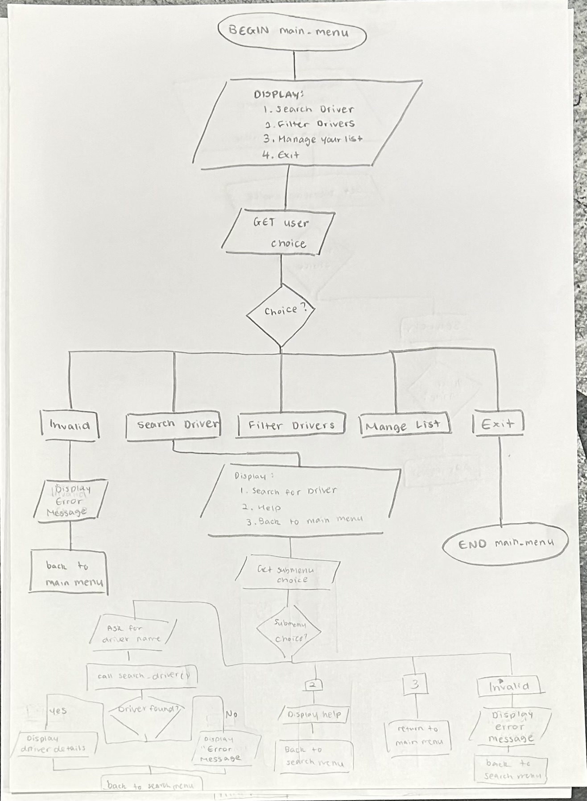

**Log Interaction**  
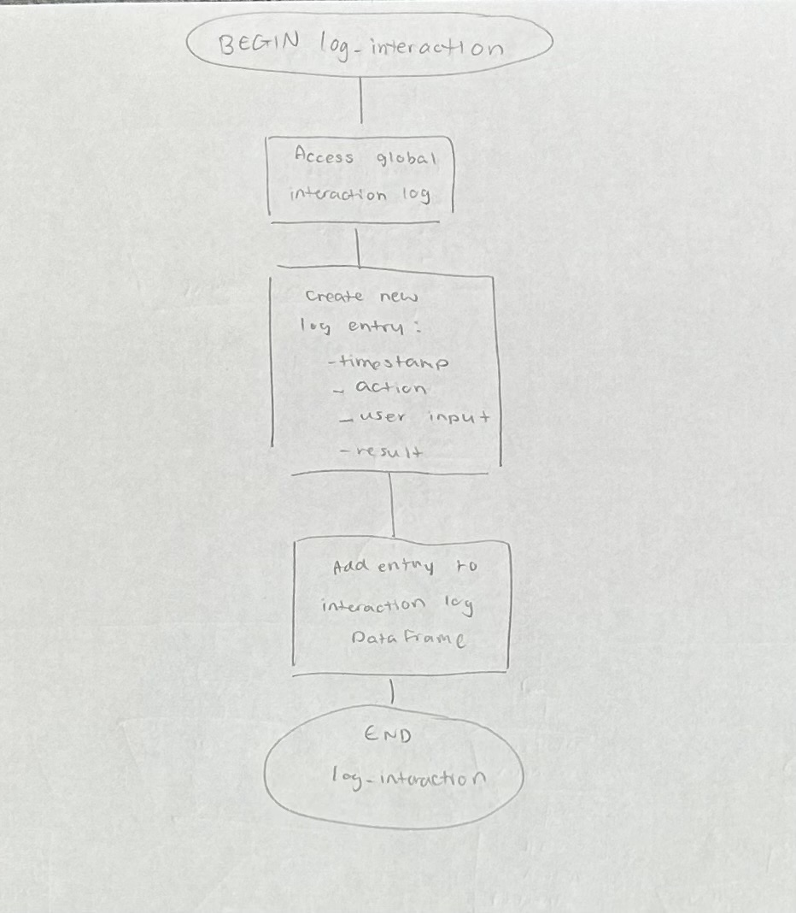

**Get Log**  
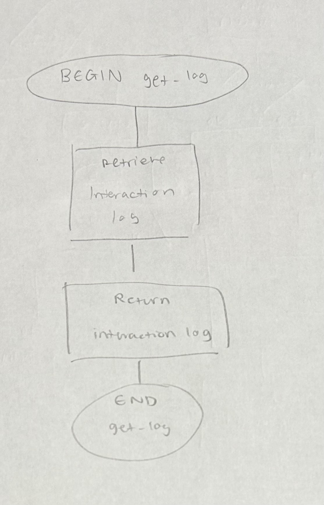

**Searching for Driver**
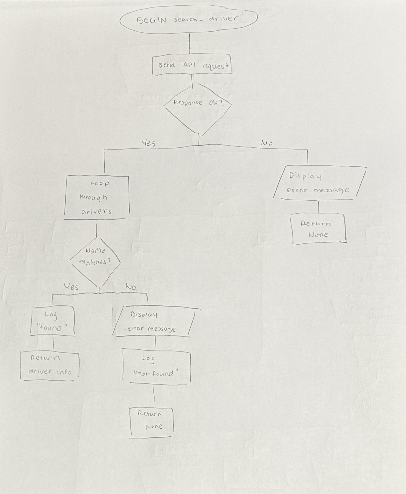

**Filtering Drivers**  
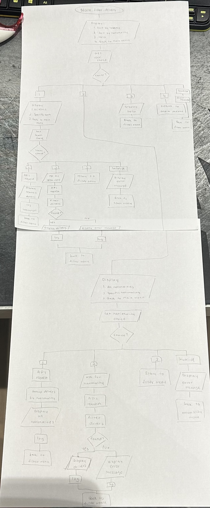

**Managing the user's list**  
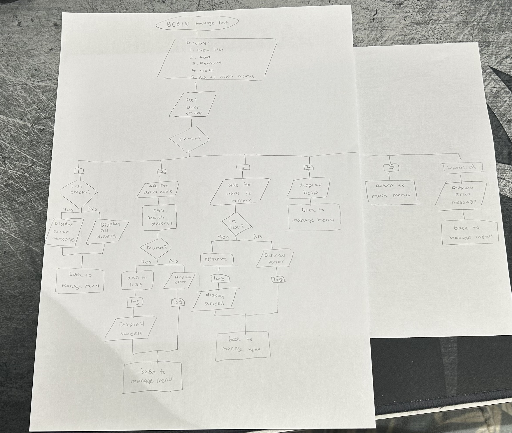

### Structure Chart


### Gantt Chart  - Development  


### Data Dictionary
| Field | Datatype | Format for display | Description | Example | Validation |
|----------|--------------|------------------------|------------------|-------------|----------------|
| Driver Name | string | XX...XX  | The full name of the F1 driver the user searches for or adds/removes from their list | Charles Leclerc | Must contain letters and spaces only; cannot be empty |
| Team | string | XX...XX | The team used when filtering drivers | Ferrari | Must match a valid team name from the API |
| Country | string | XX...XX | The country used when filtering drivers | Monaco | Must contain letters only; must match API data |
| Filter Type | string | XX...XX | Determines how the system filters drivers | team | Must be exactly “team” or "country" |
| Filter Value | string | XX...XX | The team or nationality entered by the user | Ferrari | Must match API data |
| List Action | string | XX...XX | The action the user chooses for their list | add | Must be one of the three valid options |
| User List | list | XX...XX | The list of drivers saved by the user | Charles Leclerc | No duplicates and each entry must be a valid driver |
| Error Message | string | XX...XX | Message displayed when an input or API issue occurs | Driver not found. | Must clearly describe the issue |

## Development
**main.py**
```
from functions import*

def main():
    while True:
        print("F1 Menu:")
        print("1. Search Driver")
        print("2. Filter Drivers")
        print("3. Manage your list")
        print("4. Exit")
        choice = input("Choose an option: ")

        if choice == "1":
            name = input("\nEnter driver name: ")
            driver = search_driver(name)
            if driver:  # driver was found
                max_key_len = max(len(k) for k in driver)
                for key, value in driver.items():
                    print(f"{key:<{max_key_len}} : {value}")
        elif choice == "2":
            filter_drivers()
        elif choice == "3":
            manage_list()
        elif choice == "4":
            print("Exiting driver list.")
            break
        else:
            print("Invalid choice. Please try again.")

if __name__ == "__main__":
    main()
```
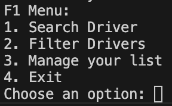

**functions.py**
```
import requests 
global name

# Dictionary to store drivers
driver_list = {}

def search_driver(name):
    if not name.strip():
        print("Invalid name.")
        return None

    print(f"\nSearching for driver '{name}'...")
    print("Driver found.")

    return {
        "name": "Name",
        "surname": "Surname",
        "birthday": "0000-00-00",
        "number": 99,
        "team": "Team_Name",
        "nationality": "Country_Name"
    }
```
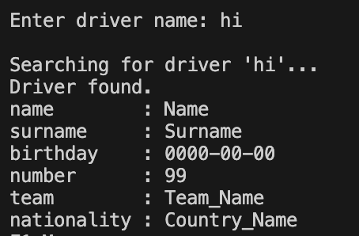
```

def filter_drivers():
    while True:
        print("What filter would you like to use?")
        print("1. Sort by teams ")
        print("2. Sort by nationality")
        print("3. Back to main menu")
        choice = input("Choose an option: ")

        if choice == "1":
            print("\nTeam Filter Options:")
            print("1. View all teams")
            print("2. View a specific team")
            print("3. Back")
            team_choice = input("Choose an option: ")

            if team_choice == "1":
                print("\nShowing all teams.")

            elif team_choice == "2":
                team = input("Enter team name: ")
                print(f"\nShowing drivers from team '{team}'.")

            elif team_choice == "3":
                return

            else:
                print("Invalid choice.")

        elif choice == "2":
            print("\nNationality Filter Options:")
            print("1. View all nationalities")
            print("2. View a specific nationality")
            print("3. Back")
            nat_choice = input("Choose an option: ")

            if nat_choice == "1":
                print("\nShowing all nationalities.")

            elif nat_choice == "2":
                nationality = input("Enter nationality: ")
                print(f"\nShowing drivers from nationality '{nationality}'.")

            elif nat_choice == "3":
                return

            else:
                print("Invalid choice.")

        elif choice == "3":
            return

        else:
            print("Invalid choice. Please try again.")
```
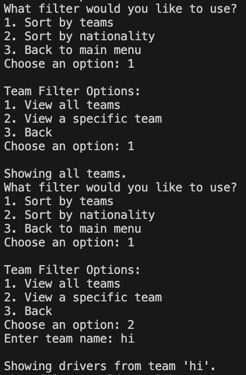
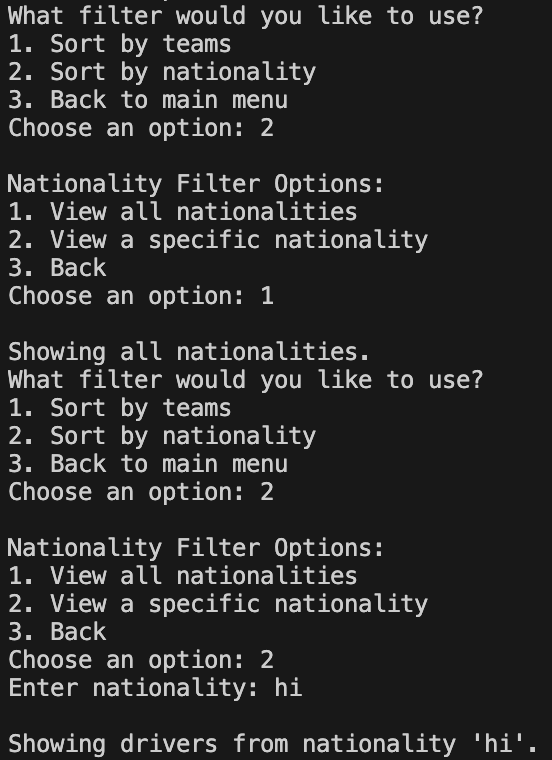
```

def manage_list():
     while True:
        print("1. View your driver list")
        print("2. Add a driver to you list")
        print("3. Remove a driver from your list")
        print("4. Exit")
        choice = input("Choose an option: ")

        if choice == "1":
            print("\nYour driver list:")
            if driver_list:
                print(", ".join(driver_list.keys()))
            else:
                print("Your driver list is empty.")

        elif choice == "2":
            name = input("Enter driver name to add: ")
            driver = search_driver(name)
            if driver:
                driver_list[name.title()] = driver
                print("Driver added.")

        elif choice == "3":
            name = input("Enter driver name to remove: ")
            if name.title() in driver_list:
                del driver_list[name.title()]
                print("Driver removed.")
            else:
                print("Driver not found in list.")

        elif choice == "4":
            return

        else:
            print("Invalid choice. Please try again.")
```
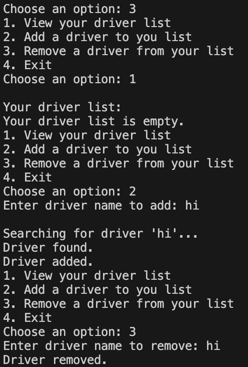

**Evaluation**  
Everything basic works in my program and nothing is producing any errors. At first, I included my API but decided to take it out and work on my basic code before making any more progress. From my first try, I improved everything including the fact that now the program works when before it didn't. 

## Integration
**Main Menu**  
  

**Search for Drivers**  
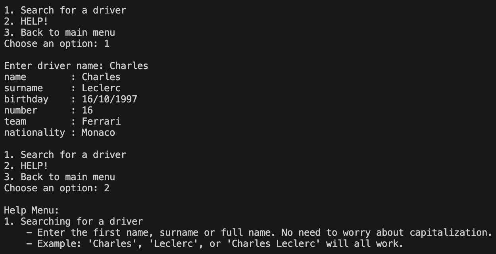

**Filtering the Drivers**  

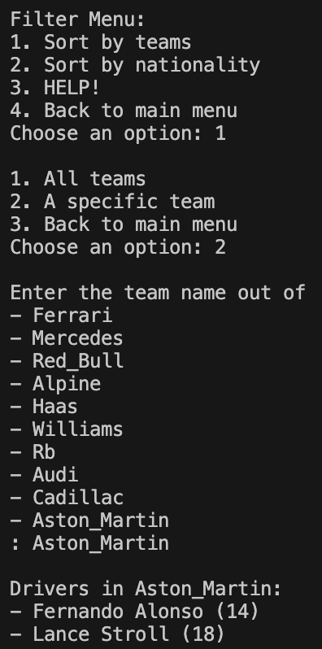
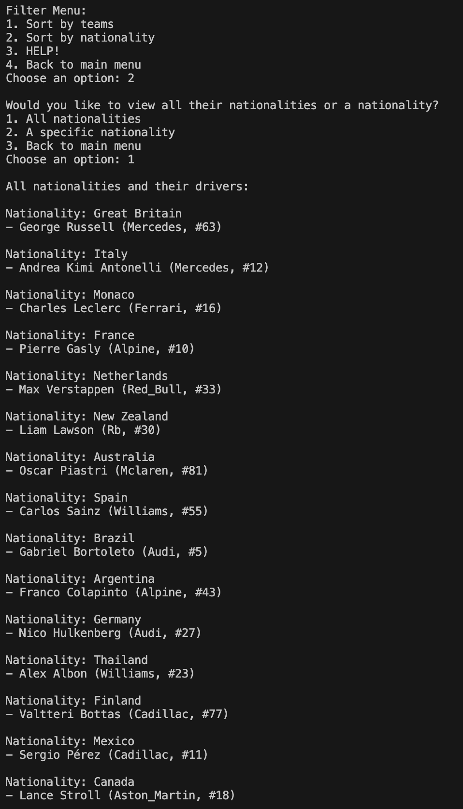
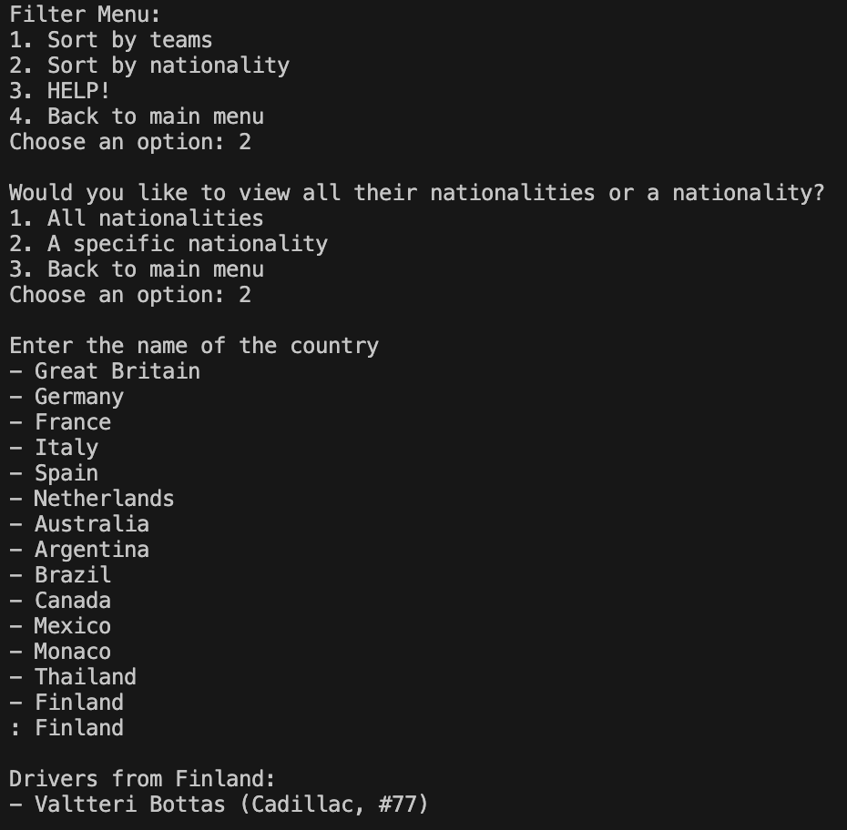
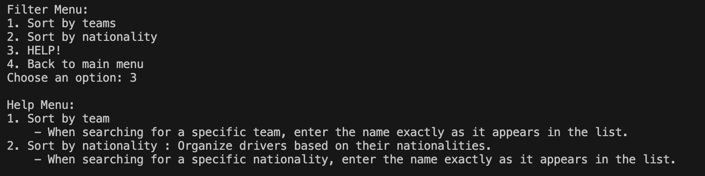

**Managing thier Lists**  
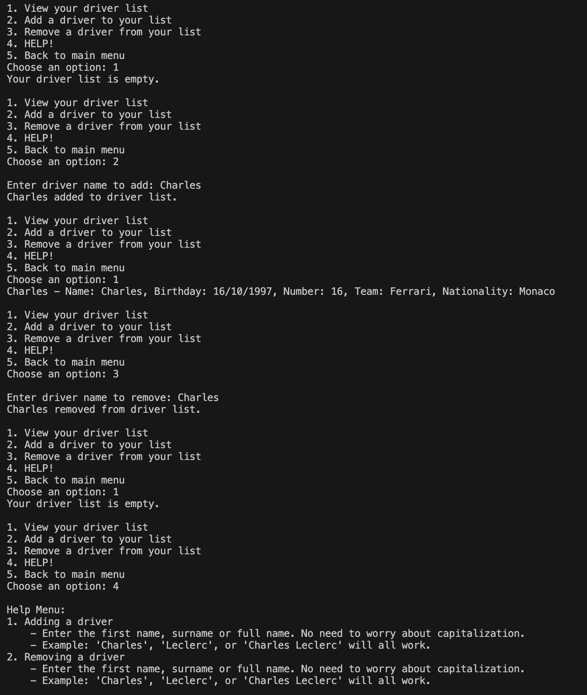

**Evaluation**  
After adding the API, everything worked smoothly wihtout a problem and also produced the error outputs. Some improvements that I want to add are logs, which can record every action the user does and produces it at when they exit the program. 

## Testing and Debugging
### Student feeback - Arisa Komatsu
Yuna's F1 API application is overall exemplary, aligning with all her functional requirements and including all features that were planned in her design stage. In terms of the outlined non-functional requirements, her program is very efficient and has fast response times within one second, and any user input errors are gracefully identified and responded to with clear error messages. Her code also allows for users to retry after any mistakes, which enhances the user experience. Additionally, her help function is specific to each feature and is very useful for navigating the program and concisely states what inputs are expected from the user. 

The README file provided for her application is comprehensive and easy to understand. One improvement could be that it could be structured a little better as in 'How to run' she states how to download the program's dependencies before stating which ones are used? idk

### Student feedback - Isabella Usacheva
Yuna's code reflects both the functional and non-functional requirements well, and the response time is immediate. Requirements.txt and the README.md file are both incredibly accurate, with the README.md file being structured nicely, and clearly explains what is required to run the program. The code runs really well, with any desired options there; I didn't want to find anything that wasn't already supplied.

## Maintenance
### How would you handle issues cause by changes to the API over time?
If the API changes in the future, the first step would be to check the updated API to understand what had been modified. Sometimes, the API might changes the names of fields, remove certain data or restructure how the information is returned. Since the program relies heavily on fields like name, surname, etc, any changes to htese would affect how the functions work. To handle this, I would update the search_driver and filter_drivers functions so they match the new structure of the API. I would also keep the error messages in place so the program can warn the user when the API is unavailable or returning unexpected data instead of crashing.

In addition, I would make sure the code stays easy to update. Because my API code is not directly mixed into the main menu, I only need to update on part of the code instead of the entire system. Logging API errors through the interaction log would also help identify when the API is down or behaving differently. This makes it easier to spot patterns and fix problems quickly. 

### How would you ensure the program remains compatible with new versions of Python and libraries
To keep my program compatible with new versions of python and the modules used the program, I would test the program using the updated programs over time. This allows me to see whether any functions have been removed, renamed or changed. If a module were to update, I could adjust the code to use the new recommended functions or syntax. 

I would also check for major updates, especially for my modules that the program depends on heavily. For example, if requests changes how the HTTP responses are handled or if pandas changes how dataframes work, I would update the relevant parts of the program. 

### Describe the steps you would take to fix a bug found in the program after deployment
If a bug appears after the program has been deployed, the first step would be to reproduce the issue so I can see exactly when and how it happens. Once I understand the conditions that caused the bug, I would look at the specific function repsonsible. For example, serach_driver if the issue involves searching or manage_list if the program is with adding or removing drivers. The interaction log would also be helpful because it records the user's actions and the program's reponses, making it easier to trace what went wrong. 

After identifying the cause of the bug, I would fix the code and test it with different inputs, including invalid inputs. This ensures the fix works in all situations. Once the bug is resolved, I would update the README.md to reflect any changes made to the program. 

### Outline how you would maintain clear documentation and ensure the program remains easy to update in the future
To keep the program easy to maintain, I would make sure the README.md file stays updated with clear instructions on how to run the program, instal dependancies and understand each feature. Whenever new features are added or existing ones are changed, I would update the documentation so it always reflects the current version of the program. Keeping the code organised would also help future fixes to be done quickly. I would also write short explanations inside the code to describe what each function does, what inputs it expects and what outputs it returns. 

## Final Evaluation
### Evaluate the current functionality of the program in terms of how well it addresses the functional and non-functional requirements
My program successfully addresses all the functional and non-functional requirements I established at the start. It retrieves accurate information about the F1 drivers, teams and nationalities and allows users to create, update and manage their own lists without errors. The system handles API calls correctly, displays clear error messages when something goes wrong and responds quickly to user inputs. All features such as filtering, searching and list management produce the expected outputs and operate consistently. Overall, my program behaves exactly as intended and matches the goals that I had set at the start of the project.

### Discuss areas for improvement or new features that could be added.
Although the program is fully functional, there are several areas of improvement that could enhance user experience and extend the functionality of my program. The help functions could have been more deatiled and advanced and integrated into the program so that you could open it whenever you want. It would also have been better is I were to improve the visual representation of the output such as adding borders, spacing or other elements like emojis. This would make the interface more engaging and easier to read. Incorporating visualisations of different elements like team logos and driver images could also make the program feel more dynamic and less text-heavy, boring and bland to read. From my peer feedback, I could add more information and better plan out my README. md file.

Some new features that could have been added include expanding the filtering system to give more flexibility. Allowing searches by driver numbers or nicknames would deepen the user's ability of explore the dataset even more. Sorting options such as alphabetical order or age could also improve navigation throughout the program. 


### Evaluate how the project was managed throughout its development and maintenance, including your time management and how challenges were addressed during the software development lifecycle.
My project management has clear areas for improvement. My requirements were clear from the beginning which helped guide the development of the program but some of my milestones weren't realistic and had to be adjusted later. This led to parts of the design phase  to be rushed, which required me to revise it all again to make sure that everything fit together. After changing and adding different components to my structure chart, I had to redo the other parts of my design making me off track from my gantt chart even more. The design section was the clear bottleneck during my task as my code came together faster than I expected it to. 

Code reviews were carried out continuously, although most of my code was completed in two major commits. As I added more code after finishing the base outline, I has to test continuously as even if it had the smallest errors, it caused the entire program to fail silently without any error notifications. The most significant challenge in my code was how to correctly fetch the API which required me to rewrite the search_driver function to avoid reaching the API endpoint before successfully retreiving the information I needed. Additional difficulties included adding the pandas and datetime modules to create my Final Interaction Log as they initially kept interfering with the other functions, causing them to glitch and output nothing. The Final Interaction Log also refused to produce anything at first as something was going wrong when creating the def function. 

Reflecting on my development markdown file, there are specific areas for improvement. Completing the structure chart early in the design phase would help me avoid major redesigning later. Enhancing the visual appeal of the outputs would create a more engaging user experience and incorporating visualisations could make the program feel more dynamic. Finally, setting more realisting milestones could help me maintain a steady workflow and reduce the need to rush through any adjustments. 