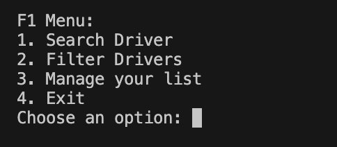
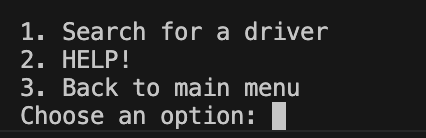
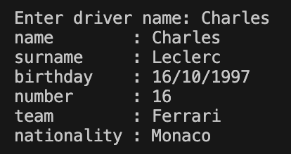
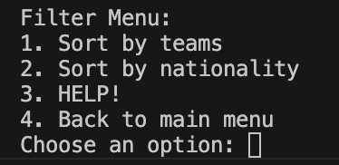
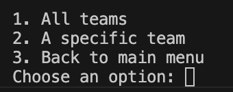
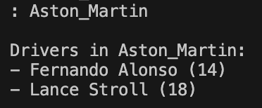
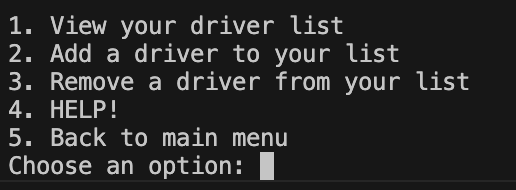
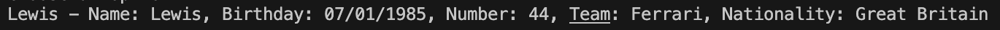
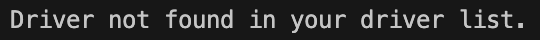
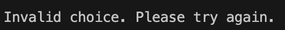

# Current F1 Drivers
10PSE Task 1

## Description and Features
The program provides information about the current F1 drivers, which is thier name, surname, birthday, number, team and nationality. You can also filter the drivers by teams or their nationality. Additionally, you can create your own lists with your chosen drivers. 

## How to run
In order to get the program working, you have to download the different modules used in the code. To do this, please enter : **pip install -r requirements.txt**. It should look like this: 

To run the program :  
As soon as you start the program this main menu will pop up. From here, type in the corresponding number to your choice. For example, you could type in '1' to search for a driver.  
   

After choosing your choice, the next screen will pop up. 
- For choice '1' - Search Driver, you will get :   
.   
Then again, you can type in your choice by the corresponding number. 
    - If your choice is '1', you can enter the name of your chosen driver by their first name, surname or both. No need to worry about capitalisation.    
    An example of a proper output given would be : . 
    - If your choice is '2', a help output is shown.
    - If your choice is '3', you will be taken back to the main menu. 
    
- For choice '2' - Filter Drivers, you will get :  
  
Then again, you can type in your choice by the corresponding number. 
    - If your choice is '1', you get to choose between another 3 options.  
      
     You can either view all teams, a specific team or go back to the main menu. If you choose to view all teams, all teams and their drivers will be listed. Choosing to view a specific team will output the list of team names, where you can choose a team. To not input wrongly, type in what is exactly shown. For example :  
       
    As seen here, 'Aston_Martin' is entered. Although the capitalisation doesn't matter, the underscore does. As seen earlier, choosing number 3 will take you back to the main menu. 
    - If your choice is '2', the same thing as choice '1' will occur but with country names instead. 
    - If your choice is '3', a help output is shown.
    - If your choice is '4', you will be taken back to the main menu.  

- For choice '3' - Manage your list, you will get :  
  
Then again, you can type in your choice by the corresponding number. 
    - If your choice is '1', you can view your driver list. Normally it would output the names of your drivers and a little information   
      
    However, if you have nobody saved in your list, if will output : "Your driver list is empty". 
    - If your choice is '2', you can add a driver to your list by typing in their name in the given space. Reminder : No need to worry about capitalisation or what part of the name you enter. First name and surname or together all work. 
    - If your choice is '3', you can remove a driver from your list by typing in their name in the given space. If the driver you chose was never in your list, this will be outputed :  
       
    - If your choice is '4', you will be taken back to the main menu.

- For choice '4' - Exit, you will get a 'Final Interaction Log' which lists your overall activity while using the program. There will also be a goodbye message. 

As you use the program and input incorrectly, the program ouputs error messages. An example would be :  
   

## Requirements
To run this program, you need to install the following dependencies or modules:
- `requests` : To make HTTP requests to download the latest data
- `pandas` : To store and track interactions in a structured DataFrame 
- `datatime` : To timestamp each interaction to record when every action happened

## Dependancies
To install the dependancies or modules, you can run : **pip install -r requirements.txt**