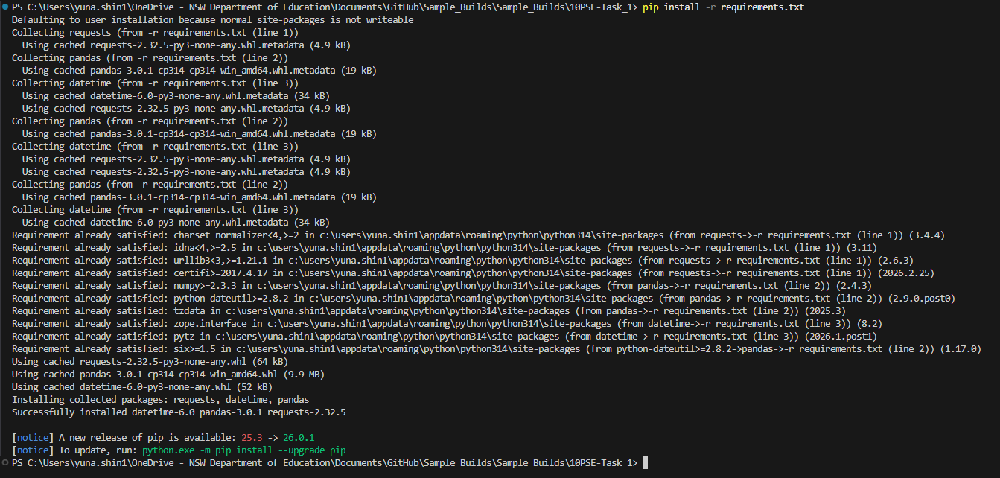

# Current F1 Drivers
10PSE Task 1

## Description
The program provides information about the current F1 drivers, which is thier name, surname, birthday, number, team and nationality. You can also filter the drivers by teams or their nationality. Additionaly, you could create your own lists with your chosen drivers. 

## How to run
In order to get the program working, you have to download the different modules used in the code. To do this, please enter : **pip install -r requirements.txt**. It should look like this: 

## Dependancies
## Installations

guide for the user